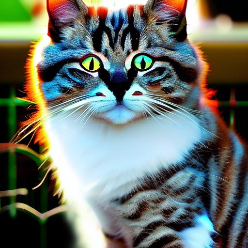

<p align="center">
  
  
  
</p>

# stable-diffusion.java

Java binding project of [stable-diffusion.cpp](https://github.com/leejet/stable-diffusion.cpp)


## Support platforms:
Windows: x86_64
Linux: x86_64
OSX: x86_64


## Usage

### Add Maven depends:

```
<dependency>
	<groupId>org.javaai.stablediffusion</groupId>
	<artifactId>StableDiffusionApi</artifactId>
	<version>1.0.4</version>
</dependency>
```

### Download models: 

- download original weights(.ckpt or .safetensors). For example
    - Stable Diffusion v1.4 from https://huggingface.co/CompVis/stable-diffusion-v-1-4-original
    - Stable Diffusion v1.5 from https://huggingface.co/runwayml/stable-diffusion-v1-5
    - Stable Diffuison v2.1 from https://huggingface.co/stabilityai/stable-diffusion-2-1

    ```shell
    curl -L -O https://huggingface.co/CompVis/stable-diffusion-v-1-4-original/resolve/main/sd-v1-4.ckpt
    # curl -L -O https://huggingface.co/runwayml/stable-diffusion-v1-5/resolve/main/v1-5-pruned-emaonly.safetensors
    # curl -L -O https://huggingface.co/stabilityai/stable-diffusion-2-1/resolve/main/v2-1_768-nonema-pruned.safetensors
    ```

#### Load StableDiffusion dynamic link library:
```Java
StableDiffusionLoader.loadShared();
```

#### Create StableDiffusion instance: 
```Java
StableDiffusion stableDiffusion = new StableDiffusion();
```

#### Load Model:
```Java
sd.loadFromFile(modelPath, null, null, null);
```

#### txt2img Example:
```Java
StableResult<Txt2ImgParams, BufferedImage> imgs = sd.txt2img("a lovely cat", 
	null, null, null, null, null, 20, 
	(long)(Math.random() * Long.MAX_VALUE), null);
```
#### Write output images to disk:
```Java
for (int i = 0; i < imgs.getResultImages().size(); i ++) {
	BufferedImage img = imgs.getResultImages().get(i);
	ImageIO.write(img, "jpg", new File(outputDir, "sd-java-txt2img-" + i + ".jpg"));
}
```

### After that, you will got images like this: 
<p align="center">
  
</p>


### img2img Example:
Input previous generated image, and give the prompt: 
##### a lovely cat with blue eyes
Let's see what will happend: 

### Java Code: 
```Java
BufferedImage inputImg = ImageIO.read(new File(outputDir, "sd-java-txt2img-0.jpg"));
StableResult<Img2ImgParams, BufferedImage> imgs = sd.img2img(inputImg, 
	"a lovely cat with blue eyes", 
	null, null, null, null, null, 20, null, 
	(long)(Math.random() * Long.MAX_VALUE));
for (int i = 0; i < imgs.getResultImages().size(); i ++) {
	BufferedImage img = imgs.getResultImages().get(i);
	
	ImageIO.write(img, "jpg", new File(outputDir, "sd-java-img2img-" + i + ".jpg"));
}
```


### Twice generated images comparison: 


<p align="center">
  <div>The second cat has blue eyes. </div>
  <div align="center">
  	
    
  </div>
  
</p>


## Don't forget close StableDiffution instance manually:
### Java Code: 
```Java
StableDiffusion sd = new StableDiffusion();
         
try {
    // Do something...
} finally {
    sd.close();
}
```

### Example to custom log output: 
``` Java
Util.setSDLogCallback((SDLogLevel, file, line, log) -> {
	System.out.println(SDLogUtil.formatLog(SDLogLevel, file, line, log));
});
```


